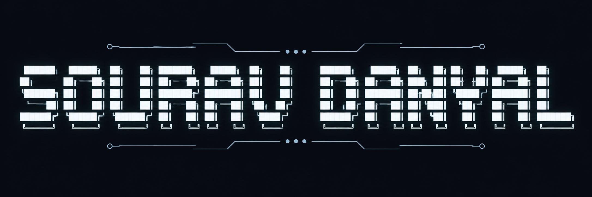

<div align="center">



<br>


</div>

---

## 💻 Terminal

```bash
> initialize_profile.sh

Name        : Sourav Danyal
Role        : AI/ML Engineer
Speciality  : NLP • Generative AI • LLMs
Status      : Learning, Building, Improving
```

---

## 🧠 About Me

Passionate about Artificial Intelligence, Machine Learning, and Natural Language Processing.

Focused on building intelligent systems powered by modern AI technologies, Large Language Models, and data-driven solutions.

Continuously exploring new advancements in Generative AI while strengthening practical skills through hands-on development and experimentation.

---

## ⚡ Tech Arsenal

<div align="center">

### Languages


### AI / ML Stack


<br><br>


### Libraries & Frameworks


<br><br>


### Databases & Tools


<br><br>


</div>

---

## 📊 GitHub Analytics

<div align="center">


</div>

---

## 🔥 Contribution Streak

<div align="center">


</div>

---

## 🌐 Connect With Me

<div align="center">

<a href="mailto:souravdanyal04@gmail.com">

</a>

<a href="https://www.linkedin.com/in/sourav-danyal-a8b35232a/">

</a>

<a href="https://www.kaggle.com/souravdanyal">

</a>

<a href="https://www.souravdanyal.me/">

</a>

</div>

---
